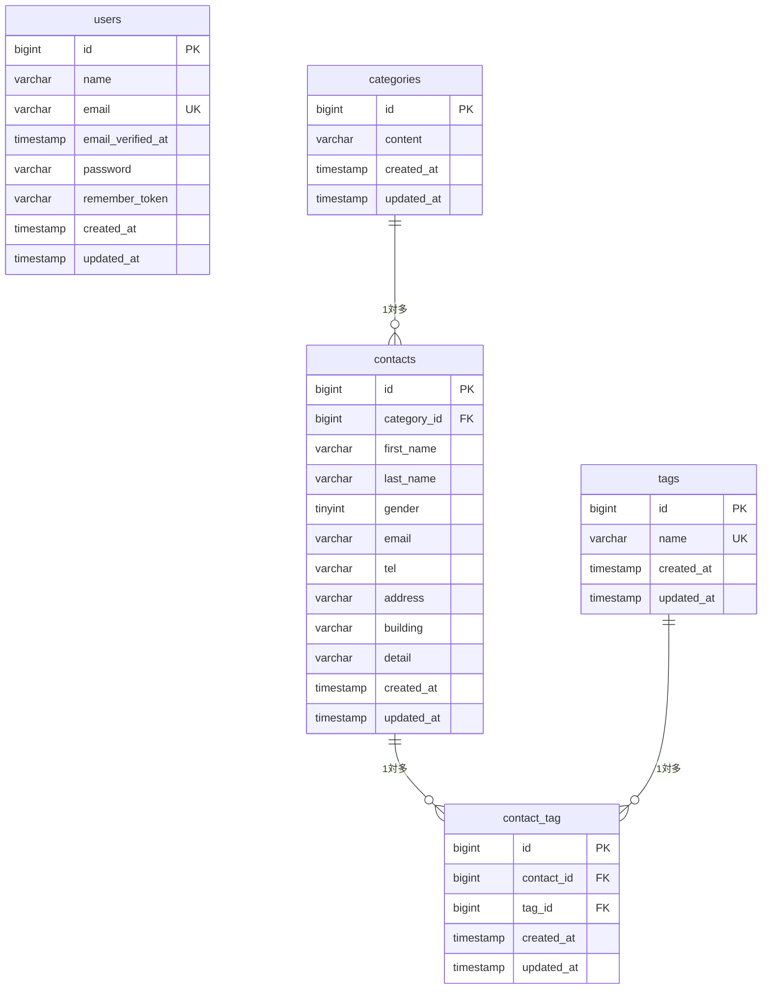

# COACHTECH お問い合わせフォーム

## 概要

一般ユーザーが誰でもお問い合わせを送信でき、管理者がログイン後にその内容を確認・管理できる Web アプリケーションです。
Blade テンプレートを使った従来型の Web アプリ(SSR・セッション認証)として実装しています。

### 実装した機能

**お問い合わせフォーム(ログイン不要)**

- 入力 → 確認 → 送信 → サンクスページの流れ
- お問い合わせの種類(カテゴリ)の選択、タグ(複数)の選択
- FormRequest によるバリデーションと、日本語のエラーメッセージ

**管理者機能(ログイン必須)**

- 管理者の登録・ログイン・ログアウト(Laravel Fortify)
- お問い合わせ一覧(7 件ごとのページネーション)
- 検索(キーワード・性別・お問い合わせの種類・日付)
- お問い合わせの詳細表示と削除
- タグの追加・編集・削除

**テスト**

- 単体テスト(バリデーション・モデルのリレーション)と機能テスト(画面・認証・管理機能)

## ER 図



- `categories` と `contacts` は **1 対多**です(1 つのカテゴリに複数のお問い合わせが属します)。
- `contacts` と `tags` は、中間テーブル `contact_tag` を介した **多対多**です。
- `contact_tag` は `(contact_id, tag_id)` の組み合わせがユニークです。
- `users` は管理者のログイン用で、ほかのテーブルとは関連しません。

## 使用技術

- PHP 8.2
- Laravel 10.x
- Laravel Fortify(認証)
- MySQL 8.0
- Nginx
- Docker / Laravel Sail
- phpMyAdmin
- Vite
- Tailwind CSS ^3.4.0
- PHPUnit(テスト)
- Laravel Pint(コード整形)

## 環境構築手順

Docker Desktop が起動していることを確認してから、次の順に実行します。

**1. リポジトリを取得する**

```bash
git clone https://github.com/nozomu8568-maker/contact-form-app.git
cd contact-form-app
```

**2. 環境変数ファイルを作る**

```bash
cp .env.example .env
```

**3. Composer のパッケージをインストールする**(PHP が手元になくても、Docker で実行できます)

```bash
docker run --rm \
    -u "$(id -u):$(id -g)" \
    -v "$(pwd):/var/www/html" \
    -w /var/www/html \
    -e COMPOSER_CACHE_DIR=/tmp/composer_cache \
    laravelsail/php82-composer:latest \
    composer install --ignore-platform-reqs
```

**4. コンテナを起動する**

```bash
./vendor/bin/sail up -d
```

> Apple Silicon (M1〜M4) の Mac でも動くよう、`compose.yaml` の `mysql` に `platform: 'linux/amd64'` を指定しています。

**5. アプリケーションキーを生成する**

```bash
./vendor/bin/sail artisan key:generate
```

**6. マイグレーションとシーディングを実行する**

```bash
./vendor/bin/sail artisan migrate --seed
```

MySQL の起動が完了する前に実行するとエラーになることがあります。その場合は、数十秒待ってから、もう一度実行してください。

**7. フロントエンドのパッケージをインストールして、開発サーバーを起動する**

```bash
./vendor/bin/sail npm install
./vendor/bin/sail npm run dev
```

`npm run dev` は実行したままにします。

## 開発環境 URL

- お問い合わせフォーム: http://localhost
- 管理画面: http://localhost/admin (ログインが必要です)
- phpMyAdmin: http://localhost:8080

### 管理画面のログイン情報(シーダーで作成)

- メールアドレス: `test@example.com`
- パスワード: `password`

## 画面・ルート一覧

| メソッド | パス | 概要 | 認証 |
| --- | --- | --- | --- |
| GET | `/` | お問い合わせ入力ページ | 不要 |
| POST | `/contacts/confirm` | 入力内容の確認ページ | 不要 |
| POST | `/contacts` | お問い合わせの保存 | 不要 |
| GET | `/thanks` | サンクスページ | 不要 |
| GET | `/register` | 管理者登録ページ | 不要 |
| GET | `/login` | ログインページ | 不要 |
| GET | `/admin` | お問い合わせ一覧・検索・タグ管理 | 必要 |
| GET | `/admin/contacts/{contact}` | お問い合わせ詳細 | 必要 |
| DELETE | `/admin/contacts/{contact}` | お問い合わせの削除 | 必要 |
| POST | `/admin/tags` | タグの追加 | 必要 |
| GET | `/admin/tags/{tag}/edit` | タグの編集ページ | 必要 |
| PUT | `/admin/tags/{tag}` | タグの更新 | 必要 |
| DELETE | `/admin/tags/{tag}` | タグの削除 | 必要 |
| GET | `/contacts/export` | お問い合わせのCSVエクスポート(検索条件を引き継ぐ) | 必要 |

## API エンドポイント一覧

公開 API(応用機能)は、現時点では未実装です。

## テストとコード整形

```bash
# テストの実行
./vendor/bin/sail test

# カバレッジ付きで実行
./vendor/bin/sail test --coverage

# コードスタイルの確認(Laravel Pint)
./vendor/bin/sail bin pint --test
```

テストは、SQLite のメモリ上の DB で実行されるため、開発用のデータには影響しません。

## 作成者

工藤望

## 開発履歴について


リポジトリ作成時にミスがあったため、リポジトリを一度削除し、同じ名前で作り直しています。
